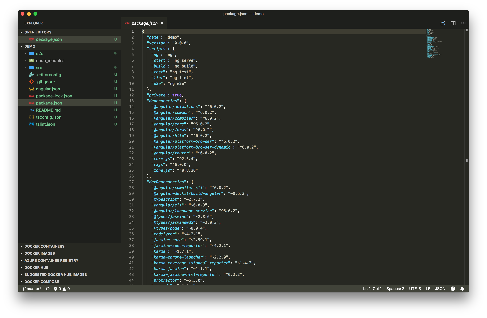
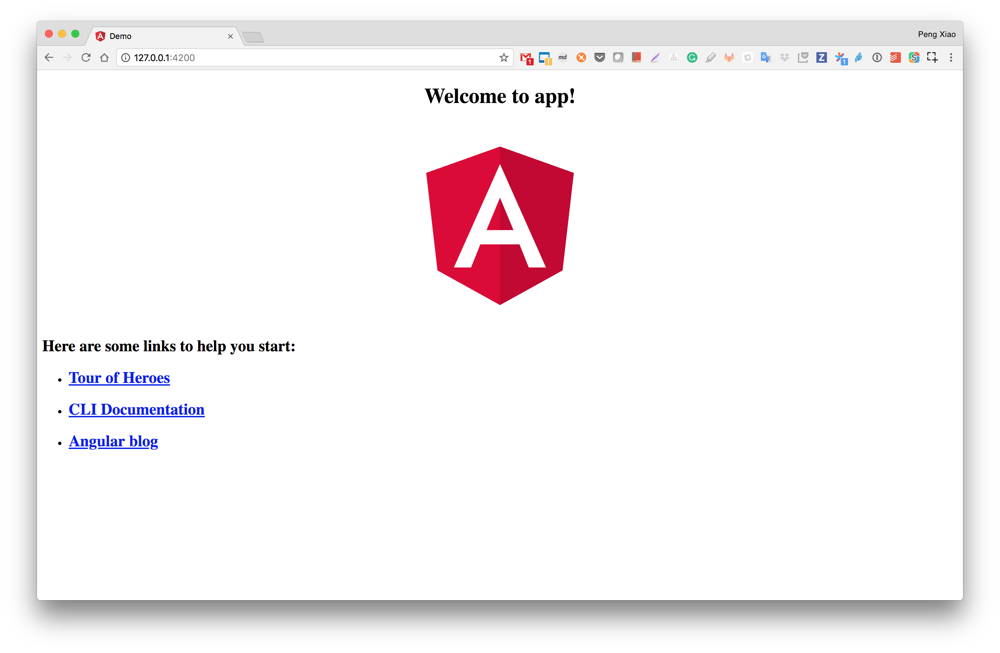

# 想开发Angular项目，但是没有开发环境？使用Docker So Easy!

不管是的开发还是学习Angular，环境是一个很大的问题，大家要在自己电脑上搭建一个Angular的开发测试环境还是非常麻烦的，请大家自行百度“搭建Angular开发环境”。OMG，要安装一堆东西。

但是有了Docker，一切变得简单至极，你的电脑只需要安装了Docker就万事大吉了。下面我们一起看一看。

## 测试环境

我们以MAC为例，请安装好Docker

```bash
docker version
Client:
 Version:      18.03.1-ce
 API version:  1.37
 Go version:   go1.9.5
 Git commit:   9ee9f40
 Built:        Thu Apr 26 07:13:02 2018
 OS/Arch:      darwin/amd64
 Experimental: false
 Orchestrator: swarm

Server:
 Engine:
  Version:      18.03.1-ce
  API version:  1.37 (minimum version 1.12)
  Go version:   go1.9.5
  Git commit:   9ee9f40
  Built:        Thu Apr 26 07:22:38 2018
  OS/Arch:      linux/amd64
  Experimental: true
```

## Angular项目的创建

我们这边给大家准备了一个Docker image，名字叫 ``xiaopeng163/angular-docker`` Dockerfile也是非常简单，大家可以参考https://github.com/xiaopeng163/angular-docker

我们这个image里安装好了Angular CLI，所以如果我们要创建一个叫做 ``demo`` 的project，在本地目录 ``/Users/penxiao/tmp/angular-docker`` 目录里，可以运行如下命令。

```bash
$ docker run --rm -it -v /Users/penxiao/tmp/angular-docker:/app xiaopeng163/angular-docker ng new demo
```

因为我们这里使用了 ``-v`` volume，会把container里通过 ``ng create demo`` 创建的project映射到我们本地 ``/Users/penxiao/tmp/angular-docker`` 目录里。

产生的project在本地如下所示。

```bash
$ ls
demo
$ cd demo
$ls
README.md         angular.json      e2e               node_modules      package-lock.json package.json      src               tsconfig.json     tslint.json
```

然后我们就可以使用我们顺手的IDE进行开发了。



## Angular项目的运行

等我们开发到一定程度以后，可以非常方便的通过 ``ng serve`` 去预览我们的项目, 注意本地Volume选择demo project的目录 ``/Users/penxiao/tmp/angular-docker/demo`` 

```bash
$ docker run -d --rm --name=angular-demo -it -v /Users/penxiao/tmp/angular-docker/demo:/app -p 4200:4200 xiaopeng163/angular-docker ng serve --host=0.0.0.0
42cadd81f28e1705ce20edcdc42a765f5dcb1d5181c4222548a984cfd37e3a95
$ docker ps
CONTAINER ID        IMAGE                        COMMAND                  CREATED             STATUS              PORTS                    NAMES
42cadd81f28e        xiaopeng163/angular-docker   "ng serve --host=0.0…"   4 minutes ago       Up 5 minutes        0.0.0.0:4200->4200/tcp   angular-demo
```

因为我们把4200端口映射到了本地，所以我们可以非常方便的预览，打开浏览器 http://127.0.0.1:4200/ 可以预览如下




## 其它

如果我们修改了 ``package-lock.json package.json`` 我们可以通过npm install去安装，

```bash
$ docker run --rm -it -v /Users/penxiao/tmp/angular-docker/demo:/app xiaopeng163/angular-docker npm install
npm WARN optional SKIPPING OPTIONAL DEPENDENCY: fsevents@1.2.4 (node_modules/fsevents):
npm WARN notsup SKIPPING OPTIONAL DEPENDENCY: Unsupported platform for fsevents@1.2.4: wanted {"os":"darwin","arch":"any"} (current: {"os":"linux","arch":"x64"})

up to date in 20.626s
```

是不是非常方便！有了docker，大家就可以尽情的玩耍了！！
